# Target Operating Process (`TO-BE`)

## Luồng end-to-end

```mermaid
flowchart LR
    Plan["Replenishment plan"] --> PO["Approved purchase order"]
    PO --> Receive["Receive and verify"]
    Receive --> QC{"QC required or exception?"}
    QC -->|Yes| Quarantine["Quarantine / inspect"]
    QC -->|No| Putaway["Put-away"]
    Quarantine -->|Released| Putaway
    Quarantine -->|Rejected| Disposition["Return / destroy / investigate"]
    Putaway --> Available["Available lot-location stock"]
    Available --> Order["Confirmed B2B order"]
    Order --> Reserve["Reserve and FEFO allocate"]
    Reserve --> Pick["Pick and scan-confirm"]
    Pick --> Stage["Stage and load"]
    Stage --> Delivery["Company delivery"]
    Delivery -->|Delivered| POD["POD and close"]
    Delivery -->|Partial / failed| Return["Return to warehouse quarantine"]
    Return --> Inspect["Inspect and disposition"]
```

## 1. Replenishment và purchasing

1. System tính một proposal có thể giải thích được dựa trên stock đã qualify, reservations, receipts đã xác nhận, demand, lead time, safety stock, MOQ, và seasonal events.
2. Bộ phận mua hàng xem xét và chỉnh proposal kèm lý do.
3. User có thẩm quyền approve purchase order.
4. Stock được đề xuất hoặc đã order không tự động trở thành on-hand stock.

## 2. Receiving và put-away

1. Nhận hàng theo purchase order dự kiến khi có thể.
2. Ghi product, supplier lot, internal lot, các field policy về MFG/EXP, UOM, expected quantity, received quantity, và discrepancy.
3. Chuyển sang product base UOM bằng conversion đang có hiệu lực.
4. Đặt hàng vào `RECEIVING`, `QC_HOLD`, hoặc `QUARANTINE` cho tới khi đủ điều kiện.
5. Release và chuyển hàng đủ điều kiện vào location lưu trữ đã được mã hóa.
6. Giữ lại evidence của receipt và dữ liệu audit actor/time.

## 3. Sales order và reservation

1. Sales ghi customer, requested date, lines, và shelf-life requirement vào RubikStock.
2. Sau confirmation, RubikStock là operational system of record của order; thay đổi tiếp theo phải đi qua controlled command/audit.
3. Xác nhận chỉ kiểm tra `available`, không phải tổng `on_hand`.
4. Policy quyết định giao đủ, giao một phần, backorder, hoặc từ chối.
5. Số lượng đã xác nhận sẽ tạo reservation một cách atomic.
6. Allocation áp dụng customer eligibility, sau đó FEFO, sau đó receipt-time tie-break, rồi mới tới pick preference vận hành.
7. Một order có thể tạo nhiều shipment và được giao bằng nhiều trip; mỗi shipment phải có quantity/state/reconciliation riêng.

## 4. Picking, staging, và loading

1. Pick task chỉ rõ product, Lot, location, và quantity.
2. Operator scan/xác nhận product, Lot, location, và quantity thực tế.
3. Nếu lệch thì phải realloc hoặc xử lý exception có kiểm soát; không được âm thầm đổi order.
4. Hàng đã pick chuyển sang staging.
5. Loading xác nhận vehicle/trip và package/quantity.
6. Xác nhận shipment sẽ tiêu thụ reservation và ghi outbound movement.

## 5. Company delivery

1. Coordinator tạo trip và phân công vehicle/driver/orders.
2. Driver chỉ thấy công việc được giao.
3. Delivery ghi nhận quantity đã giao, bị từ chối, thiếu, hư hỏng, và mang về.
4. POD được lưu riêng tư và link với shipment.
5. Bất kỳ hàng vật lý nào quay về RUBIK đều phải vào return quarantine, không đi thẳng vào available storage.
6. Order chỉ close khi mọi confirmed quantity đã delivered, cancelled hoặc được xử lý theo backorder policy.

## 6. Return, defect, và destruction

1. Link return với shipment và Lot gốc khi có thể.
2. Nhận vào trạng thái và location `RETURN_QUARANTINE`/`QUARANTINE`.
3. Kiểm tra bao bì, traceability, date, condition, và reason.
4. Approve disposition: restock, rework/repack, return to supplier, destroy, hoặc investigate.
5. Destruction cần approval độc lập và evidence.

## 7. Counting và correction

1. Tạo phạm vi count và snapshot.
2. Ghi physical count mà không hiện expected quantity khi áp dụng blind count policy.
3. Đếm lại nếu variance lớn.
4. Duyệt variance.
5. Post adjustment movement; không bao giờ overwrite history.
