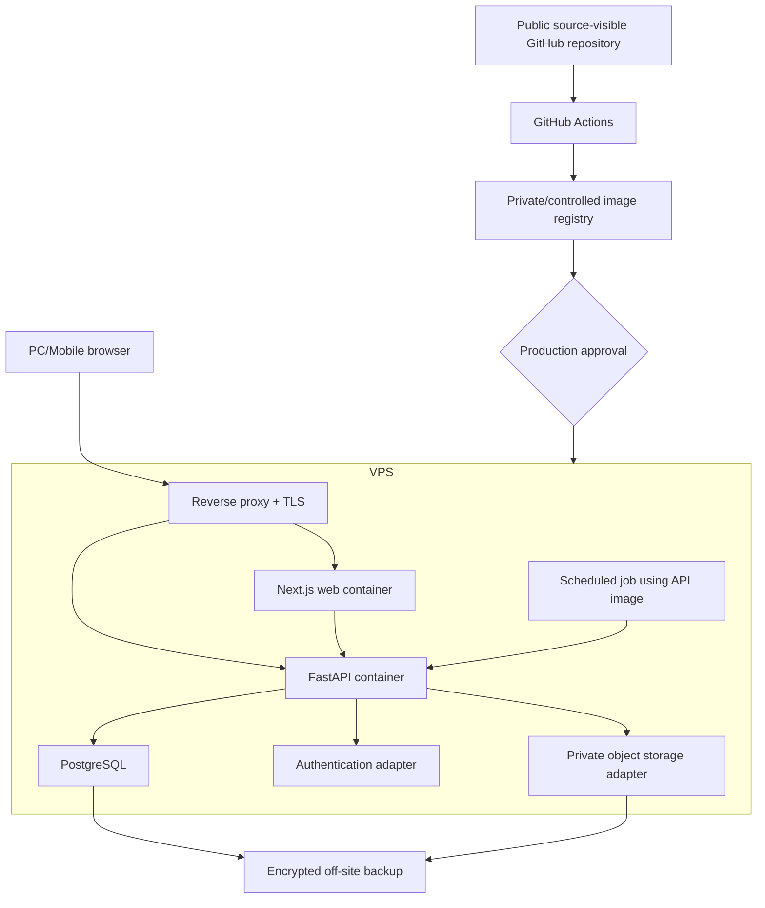

# Deployment Architecture

## Trạng thái

`ACCEPTED_TARGET`, `IMPLEMENTED_PARTIAL`. Kiến trúc Local Docker-first và VPS Docker Compose được chấp nhận qua [`ADR-0005`](adr/0005-local-docker-vps-target.md). Full-stack Local Compose đã runtime-verified; VPS deployment chưa được chứng minh.

## Target topology

## Thành phần

| Thành phần | Baseline | Trạng thái |
|---|---|---|
| Web/PWA | Next.js + TypeScript | Standalone production container local verified |
| API | Python + FastAPI + Pydantic | Container + readiness local verified |
| Persistence | SQLAlchemy 2.x | Foundation implemented |
| Migration | Alembic là schema migration authority | Baseline local verified |
| Database | PostgreSQL | Local Docker verified; VPS design pending |
| Auth | Server-side authentication adapter | Chưa chọn/implement |
| Evidence files | Private object storage adapter | Chưa chọn/implement |
| Reverse proxy/TLS | Container hoặc VPS-managed service | Chưa implement |
| Scheduled jobs | Dùng cùng immutable API image, entrypoint riêng | Chưa implement |
| CI/CD | GitHub Actions, image build/scan, protected deployment | Scaffold partial; container build chưa vào CI |

Supabase Auth/Storage/PostgreSQL vẫn có thể là managed adapter sau này, nhưng domain layer không được phụ thuộc trực tiếp provider nếu chưa có ADR mới.

## Environment topology

- Local: Docker Compose, fake deterministic seed, PostgreSQL host port `5433`; không chứa business data thật.
- Staging: isolated Compose project/VPS hoặc tương đương; database, secrets, storage và hostname riêng; chỉ synthetic/sanitized data.
- Production: Linux VPS target riêng; encrypted secrets, manual approval, backup và monitoring riêng.

Không environment nào chia sẻ database credentials, volume, object namespace hoặc signing key.

## Chính sách container và release

- Image phải pin application version; không deploy từ mutable working tree trên server.
- Compose file production không chứa secret value; secret được inject từ protected server environment.
- Migration chạy như controlled one-off job trước compatible application rollout.
- Application database role theo least privilege và không phải migration owner nếu có thể tách.
- Container có health check, resource limit, restart policy và structured log.
- Production database không publish port ra public internet.
- Reverse proxy là public entrypoint duy nhất, bắt buộc TLS.

## Background work

Các job ban đầu gồm expiry/low-stock evaluation, replenishment recommendation, import/export và audit/consistency check. Forecast chỉ chạy khi M7 qualification gate cho phép.

Mỗi job phải có stable run ID, idempotency policy, lock/concurrency rule, result status và bounded retry policy.

## D2 local evidence

- `npm run smoke:stack` build/start graph `postgres -> migrate -> api -> web`.
- PostgreSQL healthy tại host `5433`; migration one-off exit `0`.
- API `readyz` trả database `ok` tại host `8000`.
- Next.js standalone container healthy và HTTP `200` tại host `3000`.
- Success marker: `RUBIKSTOCK_STACK_SMOKE_OK`.

## D2 evidence còn thiếu

- Clean-machine reproduction ngoài development machine hiện tại.
- Auth/private storage adapter decision và tests.
- Clean VPS staging deploy/rollback command.
- TLS, firewall, backup/restore và credential rotation rehearsal.
