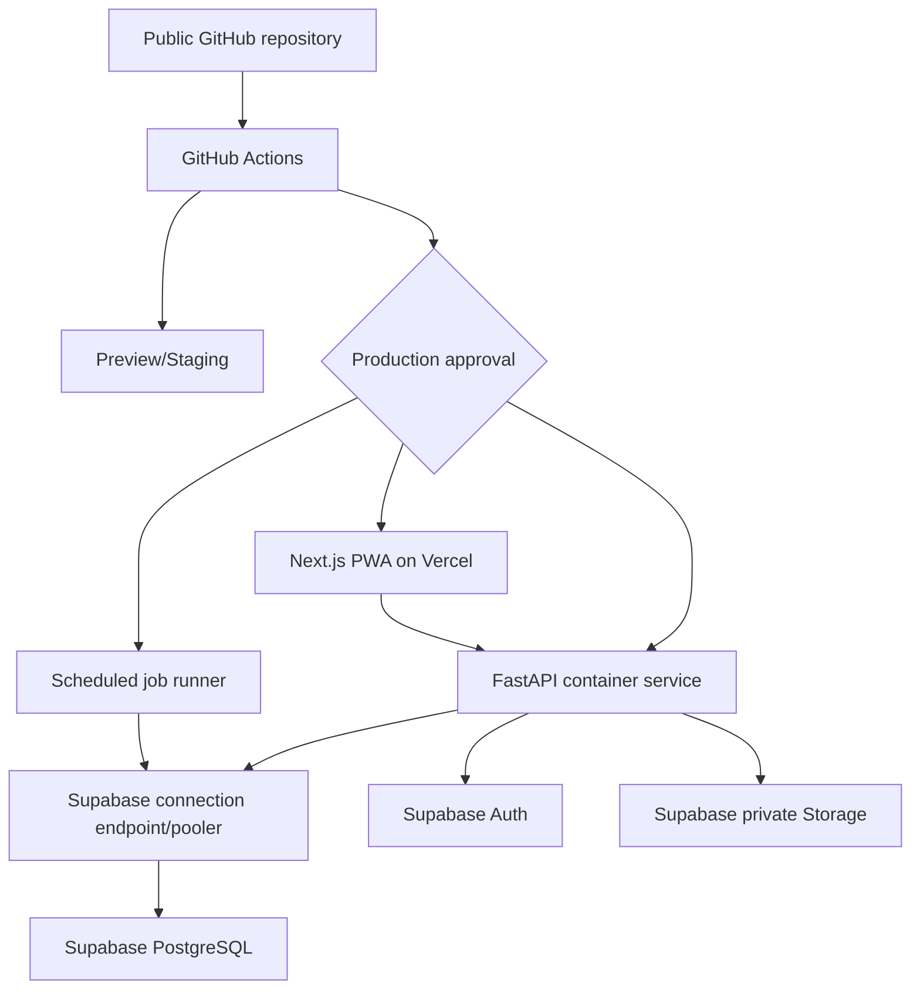

# Deployment Architecture

## Trạng thái

`PROPOSED`. Lựa chọn frontend/Supabase đi theo proposal từ discovery. Cách host production backend vẫn đang mở ở `TBD-013`.

## Topology khuyến nghị

## Thành phần đề xuất

| Thành phần | Công nghệ đề xuất | Trạng thái quyết định |
|---|---|---|
| Web/PWA | Next.js + TypeScript trên Vercel | Đề xuất |
| API | Python + FastAPI + Pydantic | Đề xuất bởi RUBIK |
| Persistence | SQLAlchemy 2.x | Đề xuất bởi RUBIK |
| Migration | Alembic là authority duy nhất cho schema migration | Đề xuất |
| Database | Supabase PostgreSQL | Đề xuất bởi RUBIK |
| Auth | Supabase Auth | Đề xuất |
| Evidence files | Supabase private Storage | Đề xuất |
| API runtime | Container platform; khuyến nghị mặc định là Cloud Run | Chưa quyết định |
| Scheduled jobs | Cùng application image, chạy dưới dạng scheduled jobs riêng | Đề xuất |
| CI/CD | GitHub Actions với environment protection | Đề xuất bởi RUBIK |

## Tách môi trường

- Local: chỉ dùng fake/seed data.
- Staging: Supabase project riêng và storage riêng; data synthetic hoặc sanitized.
- Production: project riêng, secrets riêng, backup riêng, access policy riêng, và manual deployment approval.

Không môi trường nào được chia sẻ database credentials hoặc storage bucket.

## Chính sách kết nối

- Runtime dùng chế độ kết nối phù hợp với hosting persistent hoặc serverless.
- Migration dùng direct connection có đặc quyền trong deployment job được kiểm soát.
- Application database role theo least privilege; nếu tránh được thì không để nó làm migration owner.
- Pool size và instance maximum phải bảo vệ database khỏi connection storm khi autoscaling.

## Background work

Các job ban đầu:

- Đánh giá cảnh báo expiry/low-stock.
- Sinh replenishment recommendation.
- Đánh giá forecast.
- Xử lý import/export.
- Kiểm tra audit/consistency.

Mỗi job phải có run ID ổn định, idempotency policy, lock/concurrency rule, result status, và retry policy.
