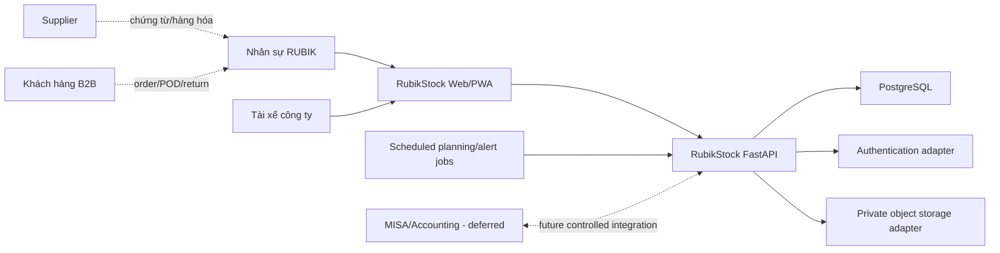

# System Context

## Ranh giới phạm vi

## Ranh giới tin cậy

- Browser/PWA không được tin cậy đối với authorization và các bất biến của stock.
- FastAPI là đường mutation duy nhất được chấp nhận cho giao dịch ảnh hưởng tồn kho.
- Database, authentication và storage credentials phải ở phía server.
- Evidence dạng file được lưu trong private bucket và chỉ phục vụ qua quyền truy cập được kiểm soát.
- Tích hợp accounting bên ngoài nằm ngoài MVP cho tới khi discovery và contract được chấp nhận; xem [`MISA_INTEGRATION_DISCOVERY.md`](MISA_INTEGRATION_DISCOVERY.md).

## Tác nhân bên ngoài

| Tác nhân/hệ thống | Đầu vào vào RubikStock | Đầu ra từ RubikStock |
|---|---|---|
| Supplier | Hàng hóa, chứng từ Lot/date, tham chiếu invoice | Tham chiếu PO/claim ở phạm vi sau |
| Khách hàng B2B | Order, ràng buộc shelf-life, yêu cầu return | Trạng thái fulfillment, evidence giao hàng |
| Sales | Ghi/xác nhận order nhận từ khách | Order operational truth sau confirmation |
| Driver | Kết quả giao hàng, POD, số lượng trả về | Chuyến xe và stop được phân công |
| MISA/Accounting | Không có trong MVP; future master/document mapping cần accepted contract | Không có trong MVP; future fulfillment/return export cần idempotency và reconciliation |

## Tư thế về availability

MVP là internal business system theo hướng online-first trên PC/mobile; connectivity kho và xe được business xác nhận là ổn định. Offline write không thuộc MVP. Khi không kết nối hoặc không xác nhận được state nguồn sự thật, các lệnh stock không an toàn phải fail closed.
