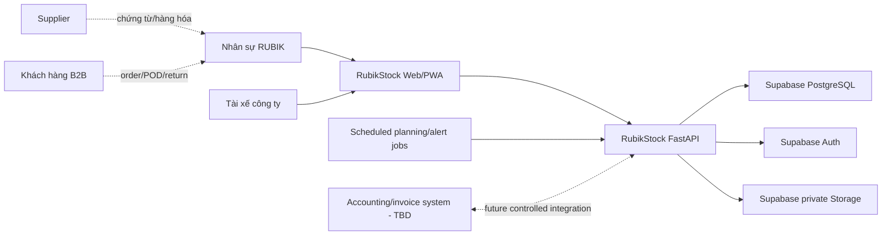

# System Context

## Ranh giới phạm vi

## Ranh giới tin cậy

- Browser/PWA không được tin cậy đối với authorization và các bất biến của stock.
- FastAPI là đường mutation duy nhất được chấp nhận cho giao dịch ảnh hưởng tồn kho.
- Database credentials và Supabase secret key phải ở phía server.
- Evidence dạng file được lưu trong private bucket và chỉ phục vụ qua quyền truy cập được kiểm soát.
- Tích hợp accounting bên ngoài nằm ngoài MVP cho tới khi contract của nó được chấp nhận.

## Tác nhân bên ngoài

| Tác nhân/hệ thống | Đầu vào vào RubikStock | Đầu ra từ RubikStock |
|---|---|---|
| Supplier | Hàng hóa, chứng từ Lot/date, tham chiếu invoice | Tham chiếu PO/claim ở phạm vi sau |
| Khách hàng B2B | Order, ràng buộc shelf-life, yêu cầu return | Trạng thái fulfillment, evidence giao hàng |
| Driver | Kết quả giao hàng, POD, số lượng trả về | Chuyến xe và stop được phân công |
| Accounting | Định danh customer/supplier/chứng từ (`TBD`) | Số lượng đã fulfilled (`TBD`) |

## Tư thế về availability

MVP là internal business system. Target về availability và hành vi offline vẫn là `TBD`, nhưng các lệnh stock không an toàn phải fail closed khi không xác nhận được state nguồn sự thật.
