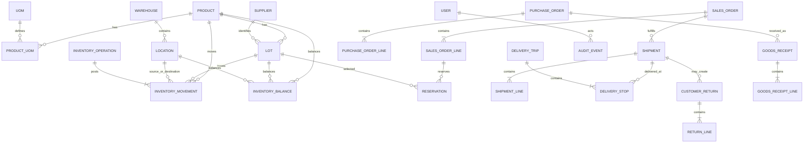

# Conceptual Data Model

## Trạng thái

`D1 ACCEPTED CONCEPTUAL CONTRACT`. Đây chưa phải migration và không được báo cáo là implemented.

## Quan hệ lõi

## Các aggregate lõi

### Catalog

- `products`
- `categories`
- `uoms`
- `product_uom_conversions`
- `suppliers`
- `customers`
- `customer_shelf_life_policies`

### Warehouse và stock

- `warehouses`
- `locations`
- `lots`
- `inventory_operations`
- `inventory_movements`
- `inventory_balances`
- `reservations`
- `stock_counts`
- `stock_count_lines`
- `stock_adjustment_requests`

### Inbound/outbound

- `purchase_orders` và lines
- `goods_receipts` và lines
- `sales_orders` và lines
- `allocations`/`reservation_allocations`
- `pick_tasks` và lines
- `shipments` và lines

### Quality và exception

- `quality_inspections`
- `inventory_holds`
- `customer_returns` và lines
- `disposition_decisions`
- `destruction_requests` và executions

### Delivery

- `vehicles`
- `drivers` hoặc link với user-role
- `delivery_trips`
- `delivery_stops`
- `delivery_results`
- `proof_of_delivery_files`

### Planning

- `supplier_product_terms`
- `safety_stock_policies`
- `business_events`
- `forecast_runs` và lines
- `replenishment_runs` và recommendations
- `manual_plan_overrides`

## Quy ước quantity và time

- Normalized quantity dùng kiểu số chính xác thích hợp với base UOM của product; cấm floating point.
- Business effective date, event `occurred_at`, record `recorded_at`, và audit timestamp phải tách biệt khi cần.
- Các date như EXP là giá trị date theo business timezone đã chấp nhận; chuyển đổi timestamp không được làm lệch expiry date.
- Tất cả aggregate có thể thay đổi phải có version để kiểm soát concurrency khi phù hợp.

## Quy ước định danh

- Primary key nội bộ có thể dùng UUID/ULID sau khi benchmark và đánh giá vận hành.
- Business code (`sku`, `location_code`, `internal_lot_code`, document number) là các định danh unique riêng.
- External/imported identifier phải giữ `source` và `source ID` để migration/integration idempotent.
